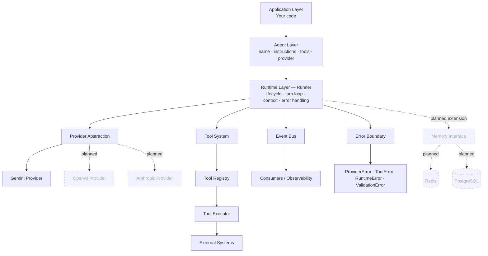
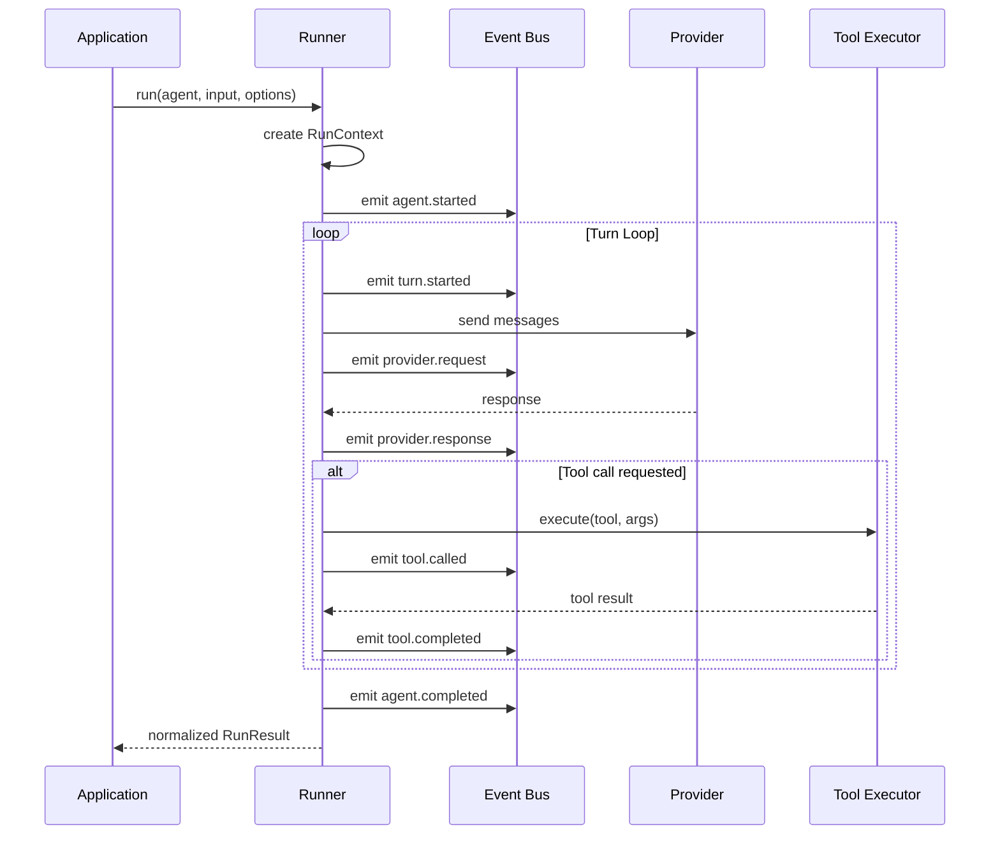

<p align="center">
  
  
  
  
</p>

<h1 align="center">Agni Agent SDK</h1>

<p align="center">
  A TypeScript-first runtime for building predictable, inspectable AI agents.
</p>

<p align="center">
  <a href="https://agni-agent-sdk-website.vercel.app/">Website</a> ·
  <a href="https://agni-agent-sdk-website.vercel.app/docs">Docs</a> ·
  <a href="#installation">Install</a> ·
  <a href="#quick-start">Quick Start</a> ·
  <a href="#architecture">Architecture</a> ·
  <a href="#roadmap">Roadmap</a>
</p>

---

> **Status: Early Preview (v1.0.0)** — the core runtime (agent definition, tool calling, Gemini provider, execution context, runtime events) is implemented and usable today. Memory, guardrails, structured output, streaming, tracing, and multi-agent handoffs are on the [roadmap](#roadmap) and not yet available. APIs may change before v1.

## Why Agni?

Most agent frameworks hide what actually happens between a prompt and a response. Retries, tool selection, provider fallback, and conversation state get buried inside orchestration you can't see or control.

Agni takes the opposite position:

- **Predictable** — the agent loop is explicit, not magic. You can read it.
- **Visible** — every step of execution emits an event you can observe.
- **No black box** — nothing runs that you didn't configure. No hidden retries, no implicit state.

Agni gives you the primitives — Agent, Runner, Provider, Tool, Context, Events — and gets out of the way.

---

## Installation

```bash
npm install agni-agent-sdk
```

```bash
pnpm add agni-agent-sdk
```

```bash
yarn add agni-agent-sdk
```

**Requirements:** Node.js 18+, TypeScript 5+

---

## Quick Start

```ts
import 'dotenv/config';
import { Agent, Runner, GeminiProvider } from 'agni-agent-sdk';

const provider = new GeminiProvider({
  apiKey: process.env.GEMINI_API_KEY!,
});

const agent = new Agent({
  name: 'assistant',
  instructions: 'You are a helpful AI assistant.',
  provider,
});

const runner = new Runner();

const result = await runner.run(agent, 'Explain how AI agents work.', {
  context: {},
});

console.log(result.output);
```

This is the entire surface area needed to run an agent. No hidden setup, no config files.

---

## Core Concepts

Agni is built around a small set of primitives. Each does exactly one job.

| Component    | Responsibility                             |
| ------------ | ------------------------------------------ |
| `Agent`      | Defines behavior, instructions, and tools  |
| `Runner`     | Executes the agent lifecycle               |
| `Provider`   | Connects to a language model               |
| `Tool`       | Gives an agent an external capability      |
| `RunContext` | Carries execution-specific data            |
| `Events`     | Exposes runtime activity for observability |

---

## Tool Calling

Agents call tools to take action beyond text generation.

```ts
import type { Tool } from 'agni-agent-sdk';

const weatherTool: Tool = {
  name: 'get_weather',
  description: 'Returns weather information for a city.',
  parameters: {
    type: 'object',
    properties: {
      city: { type: 'string' },
    },
    required: ['city'],
  },
  async execute({ city }) {
    return { city, temperature: 29, condition: 'Sunny' };
  },
};

const agent = new Agent({
  name: 'weather-agent',
  instructions: 'Use tools when required.',
  provider,
  tools: [weatherTool],
});
```

---

## Providers

Agni communicates with language models through a provider interface. The runtime depends only on this interface, so new providers can be added without changing agent or tool code.

**Available now:**

```ts
const provider = new GeminiProvider({
  apiKey: process.env.GEMINI_API_KEY!,
});
```

| Provider  | Status    |
| --------- | --------- |
| Gemini    | Available |
| OpenAI    | Planned   |
| Anthropic | Planned   |

---

## Runtime Execution

`Runner` owns the full agent lifecycle:

- Creates the execution context
- Sends requests to the provider
- Handles tool calls
- Tracks turns
- Returns a normalized result
- Publishes runtime events at each step

```ts
const result = await runner.run(agent, 'What is the weather in Pune?', {
  context: {},
});
```

### Execution Context

Pass runtime data — user IDs, workspace IDs, request-scoped state — into tools and the agent loop without smuggling it through prompts.

```ts
await runner.run(agent, 'Hello', {
  context: {
    userId: '123',
    workspaceId: 'abc',
  },
});
```

### Results

Every run returns a normalized result — success and failure share one shape.

```ts
// success
{
  success: true,
  output: 'Agent response',
  metadata: { runId: '...', turns: 2 },
}

// failure
{
  success: false,
  error: { type: 'provider_error', message: '...' },
}
```

### Runtime Events

Every meaningful step in execution emits an event. This is how Agni stays inspectable — you don't need internal access to know what an agent is doing.

```ts
runner.events.on('tool.called', (event) => {
  console.log(event.toolName);
});
```

Available events:

- `agent.started`
- `turn.started`
- `provider.request`
- `provider.response`
- `tool.called`
- `tool.completed`
- `agent.completed`

### Error System

Runtime failures surface as typed Agni errors instead of raw provider exceptions, so calling code can branch on error type instead of parsing messages.

| Error             | Raised when                                    |
| ----------------- | ---------------------------------------------- |
| `ProviderError`   | The model provider request fails               |
| `ToolError`       | A tool throws or returns an invalid result     |
| `RuntimeError`    | The execution loop fails internally            |
| `ValidationError` | Agent, tool, or input configuration is invalid |

---

## Architecture

Agni separates agent execution into independent layers — application code, agent definition, runtime orchestration, provider communication, and tool execution never depend on each other directly.

```
┌──────────────────────────────────────────────────────────┐
│  Application Layer                                        │
│  Your code — calls the Agni SDK API                       │
└───────────────────────────┬────────────────────────────────┘
                             │
┌───────────────────────────▼────────────────────────────────┐
│  Agent Layer                                                │
│  Agent definition: name · instructions · tools · provider   │
└───────────────────────────┬────────────────────────────────┘
                             │
┌───────────────────────────▼────────────────────────────────┐
│  Runtime Layer — Runner                                     │
│  Orchestrates: lifecycle · turn loop · context ·             │
│  tool calling · event publishing · error handling            │
└──────┬────────────────┬───────────────┬──────────┬──────────┘
       │                │               │          │
┌──────▼──────┐  ┌──────▼──────┐  ┌─────▼─────┐  ┌─▼──────────┐
│ Provider     │  │ Tool         │  │ Event      │  │ Error       │
│ Abstraction  │  │ System       │  │ Bus        │  │ Boundary    │
├──────────────┤  ├──────────────┤  ├────────────┤  ├─────────────┤
│ Gemini       │  │ Tool Registry│  │ Consumers /│  │ ProviderError│
│              │  │  → Executor  │  │ Observers  │  │ ToolError    │
│ ┄ OpenAI ┄   │  │  → External  │  │            │  │ RuntimeError │
│ ┄ Anthropic ┄│  │    Systems   │  │            │  │ ValidationErr│
└──────────────┘  └──────────────┘  └────────────┘  └─────────────┘

┄ dashed = planned extension, not yet implemented
```

**Memory** sits outside this diagram intentionally — it's designed as an optional interface (backed by Redis or Postgres) that plugs into the Runner rather than a required layer. It is not implemented yet; see [Roadmap](#roadmap).

### Runtime Execution Flow

What happens inside a single `runner.run()` call:

```
Application
     │  runner.run(agent, input, options)
     ▼
Runner ──── create RunContext
     │
     ├──► emit  agent.started
     │
     ▼
┌─── Turn Loop ─────────────────────────────────────────┐
│  emit  turn.started                                    │
│         │                                               │
│         ▼                                               │
│  Runner ──request──► Provider   (emit provider.request) │
│         ◄─response──          (emit provider.response) │
│         │                                               │
│         ▼                                               │
│  tool call needed? ──no──► skip                         │
│         │ yes                                           │
│         ▼                                               │
│  Runner ──execute──► Tool Executor  (emit tool.called)  │
│         ◄──result───              (emit tool.completed) │
└──────────────────────┬──────────────────────────────────┘
                        │ repeat until final response
                        ▼
              emit  agent.completed
                        │
                        ▼
              return normalized RunResult
```

### Mermaid — Architecture



### Mermaid — Runtime Execution Flow



### Design Principles

- **Explicit over implicit** — every runtime decision (turn count, tool selection, provider call) is inspectable, not inferred.
- **Composable, not monolithic** — Provider, Tool, and Event systems have no dependency on each other; each can be replaced independently.
- **Typed boundaries** — errors, results, and tool contracts are typed, not stringly-typed.
- **Extensions are opt-in** — Memory, Guardrails, and Tracing are designed as pluggable layers, not requirements to run an agent.

---

### Project Structure

```
src/
├── core/
│   ├── agent.ts
│   ├── runner.ts
│   ├── run-context.ts
│   └── types.ts
├── providers/
│   └── gemini/
├── tools/
├── streaming/
├── errors/
└── index.ts
```

---

## Roadmap

Implemented today: agent definition, tool calling, Gemini provider, execution context, runtime events, typed errors.

Planned:

- [ ] OpenAI provider
- [ ] Anthropic provider (with automatic fallback across providers)
- [ ] Streaming responses
- [ ] Memory and sessions
- [ ] Guardrails (input, output, and tool-level)
- [ ] Structured output
- [ ] Multi-agent handoffs
- [ ] Tracing and observability tooling

Tracking progress or want to propose a feature? Open an issue.

---

## Learn More

- **Website:** https://agni-agent-sdk-website.vercel.app/
- **Docs:** https://agni-agent-sdk-website.vercel.app/docs
- **Architecture deep dive:** https://agni-agent-sdk-website.vercel.app/docs/architecture/overview
- **Examples:** https://agni-agent-sdk-website.vercel.app/docs/examples/weather-agent

---

## Contributing

Contributions are welcome — bug reports, feature proposals, and pull requests.

Before opening a large PR, please open an issue first to discuss the change, since core runtime behavior (the agent loop, event contract, provider interface) is treated as a stable public surface even in preview.

---

## Repository

https://github.com/coderTejas565/agni-agent-sdk

## License

MIT
